# Voya Taxi — Booking Architecture & Process

> **Purpose:** A learning and project-reference document explaining how a Voya Taxi booking moves from customer input to a confirmed database record, chauffeur/vehicle assignment, operational availability, and completion.
>
> **Source:** Based on the current `database/schema.sql` and the implemented Voya Taxi booking workflow.
>
> **Status:** Living document. Update it whenever the booking workflow, assignment rules, statuses, or related tables change.

---

# 1. Big Picture

The booking process connects several parts of Voya Taxi:

```text
Customer
   ↓
Booking form
   ↓
Journey + passenger requirements
   ↓
Temporary journey quote
   ↓
Review
   ↓
Customer confirms
   ↓
Booking is created
   ↓
Status = pending
   ↓
Chauffeur + vehicle assignment
   ↓
Assignment validation
   ↓
Busy period / availability
   ↓
Accepted / confirmed
   ↓
Completed
```

The most important idea is:

> **A booking is not only a route. It is a connected record containing the client, journey, accepted quote, passenger requirements, chauffeur, vehicle, status, and operational scheduling.**

---

# 2. Main Tables Involved

The booking process primarily uses these tables:

| Table | Simple purpose |
|---|---|
| `clients` | Who requested the journey |
| `bookings` | The main booking record |
| `journey_quotes` | Which calculated price the customer accepted |
| `chauffeurs` | Which chauffeur is assigned |
| `vehicles` | Which exact vehicle is assigned |
| `chauffeur_availability` | When the chauffeur is available or busy |
| `user_profiles` | Connects a Supabase Auth user to an admin/chauffeur role |
| `assignment_alerts` | Stores booking assignment problems requiring admin attention |

Pricing-specific tables such as `pricing_profiles`, `pricing_rates`, `tax_rules`, `currency_rounding_rules`, and `journey_quote_items` are documented separately in:

```text
docs/PRICING_ARCHITECTURE.md
```

---

# 3. Relationship Overview

```mermaid
erDiagram
    CLIENTS ||--o{ BOOKINGS : creates
    JOURNEY_QUOTES ||--o| BOOKINGS : accepted_by
    CHAUFFEURS ||--o{ BOOKINGS : assigned_to
    VEHICLES ||--o{ BOOKINGS : assigned_to
    CHAUFFEURS ||--o{ VEHICLES : owns
    CHAUFFEURS ||--o{ CHAUFFEUR_AVAILABILITY : has
    BOOKINGS ||--o| CHAUFFEUR_AVAILABILITY : creates_busy_period
    BOOKINGS ||--o{ ASSIGNMENT_ALERTS : may_have
    CHAUFFEURS ||--o| USER_PROFILES : linked_login

    CLIENTS {
        uuid id PK
        text name
        text email
        text phone
    }

    BOOKINGS {
        uuid id PK
        uuid client_id FK
        uuid chauffeur_id FK
        uuid vehicle_id FK
        uuid journey_quote_id FK
        text pickup_location
        text destination
        date pickup_date
        time pickup_time
        int passengers
        int luggage
        text trip_type
        text status
    }

    JOURNEY_QUOTES {
        uuid quote_id PK
        text status
    }

    CHAUFFEURS {
        uuid id PK
        text account_status
        text operational_status
        boolean accepts_pets
    }

    VEHICLES {
        uuid id PK
        uuid chauffeur_id FK
        boolean is_default_vehicle
        text vehicle_status
        int seats
        int luggage_capacity
    }

    CHAUFFEUR_AVAILABILITY {
        uuid id PK
        uuid chauffeur_id FK
        uuid booking_id FK
        date available_date
        time start_time
        time end_time
        text status
    }

    ASSIGNMENT_ALERTS {
        uuid id PK
        uuid booking_id FK
        text alert_status
        text issue_summary
    }

    USER_PROFILES {
        uuid id PK
        uuid user_id FK
        uuid chauffeur_id FK
        text role
    }
```



---

# 4. `clients`

## Simple meaning

> **Who is the customer?**

Important columns:

| Column | Meaning |
|---|---|
| `id` | Unique client ID |
| `name` | Client name |
| `email` | Client email |
| `phone` | Client phone |
| `created_at` | When the client row was created |
| `updated_at` | Last update |

The database prevents duplicate clients based on a normalized email:

```text
lower(trim(email))
```

So these are treated as the same email:

```text
CLIENT@EXAMPLE.COM
client@example.com
 client@example.com
```

Relationship:

```text
clients.id
    ↓
bookings.client_id
```

One client can have many bookings.

---

# 5. `bookings` — The Central Table

## Simple meaning

> **One row in `bookings` represents one requested taxi journey.**

The booking table connects the customer, accepted price, route, requirements, chauffeur, vehicle, and booking status.

---

## 5.1 Main IDs

| Column | Easy meaning |
|---|---|
| `id` | Which exact booking is this? |
| `client_id` | Which client owns this booking? |
| `chauffeur_id` | Which chauffeur is assigned? |
| `vehicle_id` | Which exact vehicle is assigned? |
| `journey_quote_id` | Which exact price quote did the customer accept? |

Example:

```text
Booking B1
│
├── client_id        → Client C1
├── journey_quote_id → Quote Q1
├── chauffeur_id     → Chauffeur CH1
└── vehicle_id       → Vehicle V1
```

---

## 5.2 Route and Time

Important journey fields:

```text
pickup_location
pickup_city
destination
destination_city
pickup_date
pickup_time
estimated_duration_minutes
```

`pickup_location` and `destination` contain the detailed selected locations.

`pickup_city` and `destination_city` are privacy-safer city values used where full addresses are not necessary.

---

## 5.3 Passenger Requirements

The booking stores both normal capacity requirements and special transport requirements:

```text
passengers
luggage
has_pets

infant_seat_count_required
child_seat_count_required
booster_seat_count_required
isofix_required

wheelchair_requirement
wheelchair_passenger_count
mobility_aid_storage_required
extra_large_luggage_required
```

This information is later compared with the assigned vehicle and chauffeur.

---

# 6. Booking Status

The database enum `booking_status` contains:

```text
pending
accepted
rejected
confirmed
completed
cancelled
```

A simple interpretation:

```text
pending
= booking exists but has not yet entered active assignment/service

accepted
= active booking with chauffeur + vehicle assignment

confirmed
= confirmed active booking

completed
= journey finished

rejected
= booking rejected

cancelled
= booking cancelled
```

The database contains an important constraint:

```text
accepted
confirmed
completed
```

require both:

```text
chauffeur_id IS NOT NULL
vehicle_id IS NOT NULL
```

But these statuses may be unassigned:

```text
pending
rejected
cancelled
```

This protects the booking from becoming operationally active without an exact chauffeur and vehicle.

---

# 7. Trip Types

The `trip_type` enum contains:

```text
one-way
return
airport
business
hourly
```

These are stable technical database values.

The website may translate their visible labels, but the stored values remain unchanged.

---

# 8. Wheelchair Requirement

The booking uses:

```text
wheelchair_requirement_type
```

with:

```text
none
foldable
remain_in_wheelchair
```

Meaning:

```text
none
→ no wheelchair transport requirement

foldable
→ passenger transfers to a normal seat
→ folded wheelchair must be stored

remain_in_wheelchair
→ passenger remains seated in wheelchair
→ vehicle needs ramp or lift access
```

The database also checks consistency with:

```text
wheelchair_passenger_count
```

For example:

```text
wheelchair_requirement = remain_in_wheelchair
```

requires at least one wheelchair passenger.

---

# 9. From Journey Quote to Booking

The public booking process now connects a booking to the exact accepted journey quote:

```text
journey_quotes.quote_id
        ↓
bookings.journey_quote_id
```

Important rules:

```text
one quote → at most one booking
```

because `bookings.journey_quote_id` is unique.

Also:

```text
ON DELETE RESTRICT
```

means an accepted quote cannot be deleted while a booking still refers to it.

Historical/admin-created bookings may have:

```text
journey_quote_id = NULL
```

---

# 10. Customer Booking Creation Flow

Current high-level flow:

```text
Customer enters booking data
        ↓
Route is calculated
        ↓
Temporary journey quote is created
        ↓
Customer sees Review booking
        ↓
Customer confirms
        ↓
Server validates booking
        ↓
Client record is found/created
        ↓
Server rebuilds booking fingerprint
        ↓
Quote is verified
        ↓
Booking + quote acceptance happen atomically
        ↓
Booking status = pending
```

The key PostgreSQL function is:

```text
create_booking_with_accepted_journey_quote(...)
```

---

# 11. Atomic Booking + Quote Acceptance

This function protects the financial relationship between:

```text
journey quote
    ↓
customer confirmation
    ↓
booking
```

The function:

```text
locks quote
    ↓
verifies fingerprint
    ↓
verifies quote is active
    ↓
verifies quote is unexpired
    ↓
verifies quote is unused
    ↓
inserts booking
    ↓
links booking.journey_quote_id
    ↓
changes quote to accepted
    ↓
returns booking ID
```

All of this happens in one PostgreSQL transaction.

If any step fails:

```text
ROLLBACK
```

so the system does not create a booking without correctly accepting its quote.

---

# 12. Why the Booking Starts as `pending`

When the booking is first created:

```text
chauffeur_id = NULL
vehicle_id = NULL
status = pending
```

This is intentional.

The customer has created a valid booking request, but the system has not yet assigned:

```text
chauffeur
+
vehicle
```

So:

> **Customer confirmation creates the booking. Assignment makes it operational.**

---

# 13. `chauffeurs`

## Simple meaning

> **Who can perform the journey?**

Important booking-related fields:

| Column | Meaning |
|---|---|
| `id` | Chauffeur identity |
| `account_status` | Administrative account state |
| `operational_status` | Daily working availability |
| `service_area` | Service region |
| `accepts_pets` | Whether chauffeur accepts pet bookings |
| `rating` | Chauffeur rating |

### Account status

```text
pending_approval
approved
suspended
inactive
```

### Operational status

```text
available
sick
on_leave
unavailable
```

These are deliberately separate.

Example:

```text
account_status = approved
operational_status = sick
```

means:

> The chauffeur account is valid, but the chauffeur should not currently receive work.

---

# 14. `vehicles`

## Simple meaning

> **Which exact vehicle will perform the booking, and can it meet the booking requirements?**

Each vehicle belongs to one chauffeur:

```text
vehicles.chauffeur_id
        ↓
chauffeurs.id
```

Important booking-related fields:

```text
id
chauffeur_id
is_default_vehicle
vehicle_status
seats
luggage_capacity

infant_seat_count
child_seat_count
booster_seat_count
isofix_available

wheelchair_access
wheelchair_capacity
mobility_aid_storage
extra_large_luggage
```

---

# 15. Vehicle Operational Status

The `vehicle_operational_status` enum contains:

```text
available
damaged
maintenance
inactive
```

A vehicle may exist in the database but still be unsuitable for a current booking because it is not operationally available.

---

# 16. Vehicle Wheelchair Support

Vehicle wheelchair capability uses:

```text
wheelchair_access_type
```

with:

```text
none
foldable_only
ramp
lift
```

Simple relationship:

```text
Booking requirement           Vehicle requirement
-----------------------------------------------------
none                          any suitable vehicle
foldable                      foldable_only / ramp / lift as appropriate
remain_in_wheelchair          ramp or lift + enough wheelchair capacity
```

The database also prevents inconsistent vehicle data.

For example:

```text
wheelchair_access = none
wheelchair_capacity = 2
```

is invalid.

---

# 17. Assignment Validation

The PostgreSQL function:

```text
validate_booking_assignment(booking_id)
```

checks whether the current chauffeur + vehicle combination really matches the booking.

It validates areas including:

```text
chauffeur assigned
chauffeur exists
chauffeur account approved
chauffeur operationally available
chauffeur accepts pets when required

vehicle assigned
vehicle exists
vehicle belongs to chauffeur
vehicle operationally available

passenger seats
luggage capacity

infant seats
child seats
booster seats
ISOFIX

wheelchair support
wheelchair capacity
mobility-aid storage
extra-large luggage
```

The result contains:

```text
is_valid
issue_summary
issue_details
```

`issue_details` is JSON so multiple problems can be preserved.

---

# 18. Admin Assignment

The database function:

```text
update_booking_admin_assignment(...)
```

updates:

```text
booking chauffeur
booking vehicle
booking status
```

and also keeps chauffeur availability synchronized.

For active booking statuses:

```text
accepted
confirmed
completed
```

the function creates/maintains a linked busy period.

For:

```text
pending
rejected
cancelled
```

the linked booking busy period is removed.

The complete operation runs as one PostgreSQL transaction.

---

# 19. `chauffeur_availability`

## Simple meaning

> **When is a chauffeur available, busy, offline, or on holiday?**

Columns:

```text
id
chauffeur_id
booking_id
available_date
start_time
end_time
status
notes
created_at
updated_at
```

Availability statuses:

```text
available
busy
offline
holiday
```

A booking-created availability row uses:

```text
booking_id
```

to connect the busy period directly to the booking.

Database rule:

```text
booking_id IS NOT NULL
→ status must be busy
```

So a booking-linked availability record cannot incorrectly be stored as `available`.

---

# 20. Why Busy Periods Matter

Example:

```text
Booking:
10:00 pickup
estimated duration: 60 minutes
```

After active assignment:

```text
chauffeur_availability

chauffeur = CH1
booking = B1
date = booking date
start = 10:00
end = calculated trip end
status = busy
```

This prevents the same chauffeur from being treated as free during that journey.

The assignment logic also rejects conflicting booking periods.

---

# 21. Chauffeur Claim Flow

Voya Taxi also has a protected PostgreSQL function:

```text
claim_open_booking(booking_id)
```

Its security idea is very important:

> **The browser provides only the booking ID.**

The browser does **not** choose:

```text
chauffeur_id
vehicle_id
```

Instead PostgreSQL derives them from trusted data:

```text
authenticated user
        ↓
user_profiles
        ↓
chauffeur_id
        ↓
chauffeur's available default vehicle
```

---

# 22. `user_profiles`

## Simple meaning

> **Which application role belongs to the authenticated Supabase user?**

Important columns:

```text
id
user_id
role
chauffeur_id
preferred_language
```

Roles:

```text
admin
chauffeur
```

For a chauffeur:

```text
Supabase Auth user
        ↓
user_profiles.user_id
        ↓
user_profiles.chauffeur_id
        ↓
chauffeurs.id
```

This is why the chauffeur claim function does not trust a chauffeur ID sent by the browser.

---

# 23. Secure Chauffeur Claim

The claim function checks:

```text
booking ID exists
        ↓
user is authenticated
        ↓
user profile role = chauffeur
        ↓
linked chauffeur exists
        ↓
booking is still pending and unassigned
        ↓
chauffeur is approved and available
        ↓
available default vehicle exists
        ↓
booking row is locked
        ↓
assignment is made
        ↓
busy period is created
        ↓
full assignment validation runs
```

If vehicle/chauffeur requirements fail:

```text
RAISE EXCEPTION
        ↓
ROLLBACK
```

This restores:

```text
booking remains pending
chauffeur remains unassigned
vehicle remains unassigned
busy period is not kept
```

---

# 24. Why the Booking Row Is Locked

The claim function uses:

```sql
FOR UPDATE
```

Concept:

```text
Chauffeur A clicks Claim
Chauffeur B clicks Claim
at nearly the same time
```

PostgreSQL allows one transaction to lock the booking first.

```text
A locks booking
        ↓
B waits
        ↓
A completes claim
        ↓
B continues
        ↓
B sees booking is no longer pending/unassigned
        ↓
B is rejected
```

This prevents two chauffeurs from successfully claiming the same booking.

---

# 25. Default Vehicle

The claim workflow uses the chauffeur's **available default vehicle**.

The vehicle table stores:

```text
is_default_vehicle
```

The database contains logic to keep the default vehicle consistent when vehicles are created, moved, disabled, or deleted.

This is important because:

> A chauffeur claim should select a trusted vehicle from the database, not a vehicle ID supplied by the browser.

---

# 26. `assignment_alerts`

## Simple meaning

> **Is there currently a problem with the chauffeur/vehicle assigned to a booking?**

Important columns:

| Column | Meaning |
|---|---|
| `id` | Alert identity |
| `booking_id` | Booking with the problem |
| `alert_status` | `open` or `resolved` |
| `issue_summary` | Main readable problem |
| `issue_details` | All detected problems as JSON |
| `source_type` | What kind of change caused/rechecked the issue |
| `source_id` | Related changed record |
| `first_detected_at` | When problem first appeared |
| `last_checked_at` | Last validation |
| `resolved_at` | When it became valid again |

---

# 27. Assignment Alert Lifecycle

The function:

```text
sync_booking_assignment_alert(...)
```

runs the assignment validator.

Flow:

```text
validate booking assignment
        ↓
invalid?
   YES
        ↓
create/update one open alert

valid?
   YES
        ↓
resolve current open alert
```

Resolved alerts are kept as history.

The database permits:

```text
one current open alert per booking
+
many resolved historical alerts
```

---

# 28. Why Assignment Alerts Are Useful

Suppose an accepted booking is assigned to:

```text
Chauffeur CH1
Vehicle V1
```

Later:

```text
CH1 → sick
```

or:

```text
V1 → maintenance
```

The booking itself should not disappear.

Instead:

```text
booking remains stored
        ↓
assignment becomes invalid
        ↓
assignment_alerts records the problem
        ↓
admin can correct the assignment
```

This separates:

```text
booking history
```

from:

```text
temporary operational problem
```

---

# 29. Booking `updated_at`

The schema contains a reusable trigger function that automatically updates `updated_at`.

For `bookings`:

```text
booking row changes
        ↓
BEFORE UPDATE trigger
        ↓
updated_at = now()
```

This gives the application a reliable last-modified timestamp.

The same mechanism is also used by several related tables.

---

# 30. Row Level Security

RLS is enabled on important booking-related tables including:

```text
clients
chauffeurs
vehicles
bookings
chauffeur_availability
assignment_alerts
user_profiles
```

Sensitive operations are performed through trusted server/database logic rather than unrestricted browser table access.

---

# 31. Booking IDs — Simple Reference

| ID | Meaning |
|---|---|
| `bookings.id` | One exact booking |
| `bookings.client_id` | Client who owns the booking |
| `bookings.journey_quote_id` | Accepted quote that produced the booking |
| `bookings.chauffeur_id` | Assigned chauffeur |
| `bookings.vehicle_id` | Assigned vehicle |
| `chauffeur_availability.booking_id` | Busy period created for the booking |
| `assignment_alerts.booking_id` | Assignment problem belonging to the booking |
| `vehicles.chauffeur_id` | Chauffeur that owns the vehicle |
| `user_profiles.chauffeur_id` | Chauffeur profile linked to the logged-in user |

---

# 32. Example Complete Booking

```text
Client
C1
│
└── Booking B1
    │
    ├── journey_quote_id → Q1
    │
    ├── pickup → Amsterdam
    │
    ├── destination → Rotterdam
    │
    ├── passengers → 2
    │
    ├── luggage → 2
    │
    ├── infant seats → 1
    │
    ├── status → accepted
    │
    ├── chauffeur_id → CH1
    │
    └── vehicle_id → V1
          │
          ├── seats → enough
          ├── luggage → enough
          └── infant seat → available

CH1
│
└── chauffeur_availability
    └── booking_id → B1
        status → busy
```

If V1 later becomes unavailable:

```text
B1
│
└── assignment_alerts
    └── "Vehicle is not operationally available"
```

The booking itself remains preserved.

---

# 33. Booking Lifecycle — Simple Mental Model

```text
CUSTOMER
fills booking form
        ↓

PRICING
creates temporary quote
        ↓

CUSTOMER
reviews and confirms
        ↓

DATABASE
creates booking
status = pending
quote = accepted
        ↓

ASSIGNMENT
chauffeur + vehicle selected
        ↓

VALIDATION
does assignment satisfy booking requirements?
        ↓

AVAILABILITY
create linked busy period
        ↓

OPERATIONS
accepted / confirmed
        ↓

JOURNEY FINISHES
completed
```

Alternative endings:

```text
pending → rejected
pending/active → cancelled
```

---

# 34. Important Separation of Responsibilities

The architecture intentionally separates several questions.

## Booking

```text
What journey did the customer request?
```

Stored mainly in:

```text
bookings
```

## Pricing

```text
How much does the journey cost?
```

Stored mainly in:

```text
journey_quotes
journey_quote_items
```

## Assignment

```text
Who will drive and which vehicle will be used?
```

Stored mainly through:

```text
bookings.chauffeur_id
bookings.vehicle_id
```

## Availability

```text
Is the chauffeur free at that time?
```

Stored in:

```text
chauffeur_availability
```

## Operational health

```text
Is the current chauffeur/vehicle assignment still valid?
```

Stored/checked through:

```text
validate_booking_assignment(...)
assignment_alerts
```

---

# 35. Key PostgreSQL Functions in the Booking Process

| Function | Purpose |
|---|---|
| `create_booking_with_accepted_journey_quote(...)` | Atomically creates booking + accepts quote |
| `update_booking_admin_assignment(...)` | Updates chauffeur, vehicle, status, and busy period |
| `validate_booking_assignment(...)` | Checks chauffeur/vehicle suitability |
| `sync_booking_assignment_alert(...)` | Creates/resolves assignment alerts |
| `claim_open_booking(...)` | Securely allows an authenticated chauffeur to claim a pending booking |
| `get_enum_values(...)` | Returns enum values such as booking statuses |

There are also supporting trigger/default-vehicle functions in the schema.

---

# 36. Key Database Constraints

Important database protections include:

```text
client_id must exist
journey_quote_id references a real quote
one journey quote can create at most one booking
accepted/confirmed/completed require chauffeur + vehicle
passenger-support counts cannot be negative
wheelchair requirement must match wheelchair passenger count
booking-linked availability must be busy
one open assignment alert per booking
vehicle capability data must remain internally consistent
```

These rules are valuable because they protect data even if application code contains a bug.

---

# 37. Booking Process vs Pricing Process

These two documents overlap at one important boundary:

```text
PRICING
creates and protects quote Q1
        ↓
customer accepts Q1
        ↓
---------------- BOUNDARY ----------------
        ↓
BOOKING
creates booking B1 linked to Q1
```

So:

```text
PRICING_ARCHITECTURE.md
```

explains:

> **How was the price calculated and protected?**

while:

```text
BOOKING_ARCHITECTURE.md
```

explains:

> **How does an accepted journey become an operational taxi booking?**

---

# 38. Maintenance Rule for This Document

Update this file whenever one of these changes:

```text
booking statuses
booking table structure
passenger-support requirements
client relationship
quote → booking relationship
chauffeur assignment rules
vehicle matching rules
chauffeur claim workflow
busy-period synchronization
assignment alerts
booking security/RLS
booking-related PostgreSQL functions
```

Suggested project location:

```text
docs/BOOKING_ARCHITECTURE.md
```

---

# 39. Key Learning Summary

Remember these sentences:

> **`clients` tells us WHO requested the journey.**

> **`bookings` tells us WHAT journey was requested and its operational state.**

> **`journey_quote_id` tells us WHICH accepted price belongs to the booking.**

> **`chauffeur_id` tells us WHO will drive.**

> **`vehicle_id` tells us WHICH exact vehicle will perform the journey.**

> **`chauffeur_availability` tells us WHEN the chauffeur is occupied or available.**

> **`validate_booking_assignment()` asks: “Can this chauffeur and vehicle safely satisfy this booking?”**

> **`assignment_alerts` tells the admin when an existing assignment becomes operationally invalid.**

> **`user_profiles` connects the authenticated user to the trusted chauffeur identity.**

> **A booking becomes reliable because the database protects its relationships, not because the browser simply sends IDs.**
