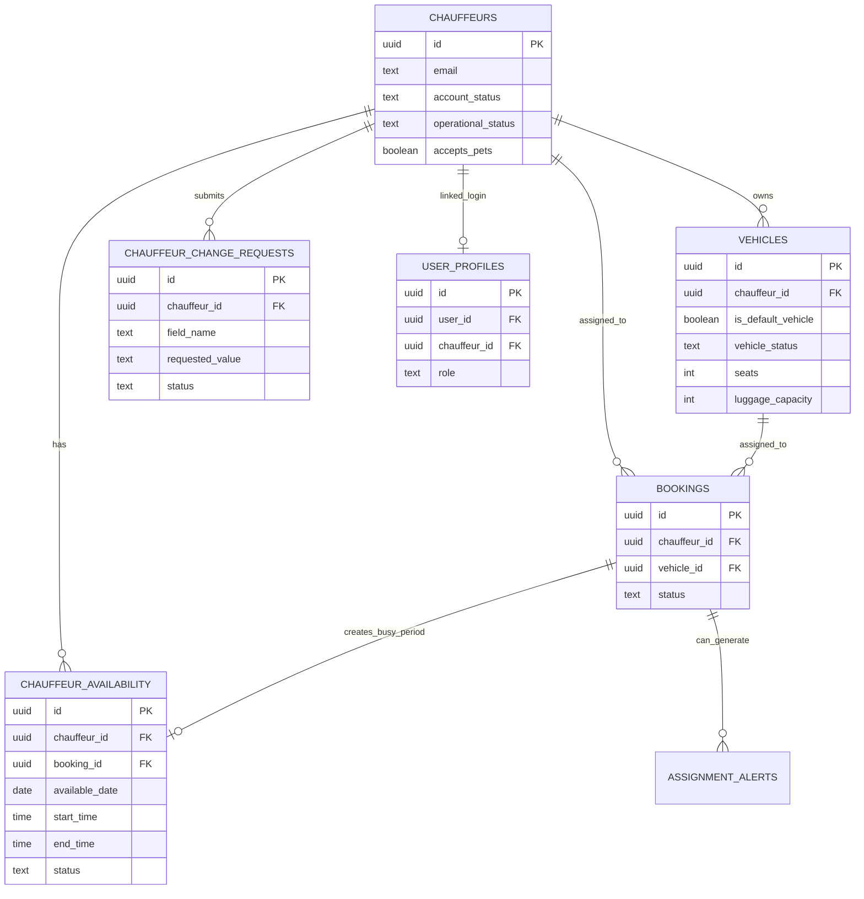

# Voya Taxi — Chauffeur & Vehicle Operations Architecture

> **Purpose:** Explain the chauffeur lifecycle, vehicle management, availability, change requests, booking claims, and operational validation.
>
> **Status:** Living document. Update whenever chauffeur, vehicle, availability, claim, or operational-status rules change.

---

# 1. Big Picture

The chauffeur operations domain answers:

> **Who is allowed to drive, which vehicle can be used, when is the chauffeur available, and can the chauffeur safely accept this booking?**

High-level flow:

```text
Public chauffeur registration
        ↓
pending_approval
        ↓
Admin review
        ↓
approved
        ↓
Auth user linked through user_profiles
        ↓
Vehicles
        ↓
Default vehicle
        ↓
Availability / operational status
        ↓
Open bookings
        ↓
Secure claim
        ↓
Assignment validation
        ↓
Busy period
        ↓
Assigned work
```

---

# 2. Main Tables

| Table | Purpose |
|---|---|
| `chauffeurs` | Main chauffeur business/profile record |
| `vehicles` | Vehicles belonging to chauffeurs |
| `chauffeur_availability` | Availability/busy/offline/holiday periods |
| `user_profiles` | Links Supabase Auth users to chauffeur identity |
| `chauffeur_change_requests` | Requests to change admin-controlled chauffeur fields |
| `bookings` | Work assigned/claimed by chauffeur |
| `assignment_alerts` | Problems with current chauffeur/vehicle assignment |

---

# 3. Relationship Overview



---

# 4. `chauffeurs`

## Simple meaning

> **One row represents one chauffeur business/profile known to Voya Taxi.**

Important columns include:

```text
id
name
email
phone
company_name
license_number
service_area
account_status
operational_status
status_reason
status_changed_at
rating
accepts_pets
bio
profile_photo_path
created_at
updated_at
```

---

# 5. Chauffeur Account Status

The account lifecycle uses:

```text
pending_approval
approved
suspended
inactive
```

## `pending_approval`

```text
chauffeur registered
admin has not approved yet
```

## `approved`

```text
administratively allowed to receive work
```

## `suspended`

```text
temporarily blocked
```

## `inactive`

```text
account not currently active
```

---

# 6. Account Status vs Operational Status

These are deliberately separate.

## Account status

Question:

> **Is this chauffeur account administratively valid?**

## Operational status

Question:

> **Can this chauffeur work right now?**

Operational values:

```text
available
sick
on_leave
unavailable
```

Example:

```text
account_status = approved
operational_status = sick
```

means:

> The chauffeur account is valid, but should not receive new work now.

---

# 7. Chauffeur Registration Flow

Concept:

```text
Public registration form
        ↓
chauffeurs row
        ↓
account_status = pending_approval
        ↓
Admin reviews
        ↓
approved / suspended / inactive
```

Registration status can be checked separately from authenticated chauffeur operations.

---

# 8. Authentication Link

A chauffeur business record is linked to a login through:

```text
auth.users.id
        ↓
user_profiles.user_id
        ↓
role = chauffeur
        ↓
user_profiles.chauffeur_id
        ↓
chauffeurs.id
```

This separates:

```text
login identity
```

from:

```text
business chauffeur record
```

---

# 9. Why This Separation Is Useful

The chauffeur row can exist before authentication linkage.

That supports:

```text
registration
admin approval
business-record maintenance
later authenticated account connection
```

It also lets PostgreSQL derive chauffeur identity from the logged-in user during secure claims.

---

# 10. `chauffeur_change_requests`

Some chauffeur fields are administrator-controlled.

Current allowed request fields include:

```text
name
email
company_name
license_number
```

Instead of directly editing these values, the chauffeur can create a change request.

Important columns:

```text
id
chauffeur_id
field_name
current_value
requested_value
reason
status
admin_note
reviewed_by
reviewed_at
created_at
updated_at
```

---

# 11. Change Request Status

Current values:

```text
pending
approved
rejected
```

A partial unique index allows only one pending request per:

```text
chauffeur
+
field_name
```

This prevents multiple simultaneous pending requests for the same protected field.

---

# 12. Why Change Requests Matter

Direct self-editing is appropriate for some profile information.

But regulated/admin-controlled identity information benefits from:

```text
request
        ↓
admin review
        ↓
approved / rejected
        ↓
audit history
```

This gives better operational control.

---

# 13. `vehicles`

## Simple meaning

> **One row represents one exact vehicle belonging to one chauffeur.**

Each vehicle links through:

```text
vehicles.chauffeur_id
        ↓
chauffeurs.id
```

Important fields include:

```text
id
chauffeur_id
vehicle_type
make
model
year
license_plate
color
is_default_vehicle
vehicle_status
status_reason
status_changed_at
seats
luggage_capacity
infant_seat_count
child_seat_count
booster_seat_count
isofix_available
wheelchair_access
wheelchair_capacity
mobility_aid_storage
extra_large_luggage
created_at
updated_at
```

---

# 14. Vehicle Types

Current enum values include:

```text
standard
business
luxury
van
minibus
wheelchair
```

These are technical stored values.

Visible labels may be translated in the UI without changing database values.

---

# 15. Vehicle Operational Status

Vehicle operational values:

```text
available
damaged
maintenance
inactive
```

Question:

> **Can this exact vehicle be used operationally right now?**

A vehicle can remain in the database while temporarily unavailable.

---

# 16. Vehicle Capacity

The database stores:

```text
seats
luggage_capacity
```

These are compared against booking requirements.

Database checks prevent invalid negative capacity values.

---

# 17. Child-Safety Capabilities

Vehicle capabilities include:

```text
infant_seat_count
child_seat_count
booster_seat_count
isofix_available
```

These can be compared with booking passenger-support requirements before assignment/claim succeeds.

---

# 18. Wheelchair Capabilities

Vehicle support includes:

```text
wheelchair_access
wheelchair_capacity
mobility_aid_storage
```

Current access types:

```text
none
foldable_only
ramp
lift
```

The database enforces internal consistency.

Example:

```text
wheelchair_access = none
wheelchair_capacity = 2
```

is invalid.

---

# 19. Extra-Large Luggage

Vehicles also store:

```text
extra_large_luggage
```

This allows assignment validation to distinguish ordinary luggage capacity from special oversized-luggage support.

---

# 20. Default Vehicle

A chauffeur can have a default vehicle:

```text
is_default_vehicle = true
```

A partial unique index ensures:

> **At most one default vehicle per chauffeur.**

This is critical for chauffeur self-claim because the browser does not choose the vehicle.

---

# 21. Default-Vehicle Rules

The database has logic including:

```text
set_default_vehicle(...)
ensure_single_vehicle_default(...)
prepare_vehicle_default_before_change()
reconcile_vehicle_defaults_after_change()
```

Purpose:

```text
keep default vehicle valid
prevent unavailable vehicle remaining default
re-evaluate defaults when vehicle owner/status changes
```

---

# 22. Automatic Single-Vehicle Default

The system can automatically manage a chauffeur who has only one vehicle.

Conceptual rules:

```text
No vehicles
→ no default

One available vehicle
→ make it default

One unavailable vehicle
→ remove default

Multiple vehicles
→ do not choose automatically
```

This reduces unnecessary admin/chauffeur work.

---

# 23. Vehicle Changes and Default Reconciliation

Default-vehicle synchronization reacts when a vehicle is:

```text
created
deleted
moved to another chauffeur
made available
made unavailable
```

This keeps the default relationship from becoming stale.

---

# 24. `chauffeur_availability`

## Simple meaning

> **When is the chauffeur available or unavailable?**

Important columns:

```text
id
chauffeur_id
booking_id
available_date
start_time
end_time
status
notes
created_at
updated_at
```

Availability status:

```text
available
busy
offline
holiday
```

---

# 25. Manual vs Booking-Created Availability

Availability has two business meanings.

## Manual operational period

Example:

```text
holiday
offline
available
```

## Booking-created busy period

Example:

```text
booking_id = B1
status = busy
```

A booking-linked availability row must be:

```text
busy
```

---

# 26. Busy-Period Protection

The database prevents overlapping busy periods for the same chauffeur.

Concept:

```text
same chauffeur
+
overlapping time range
→ rejected
```

But:

```text
same chauffeur + separate times
→ allowed

different chauffeurs + same time
→ allowed
```

This protects scheduling integrity.

---

# 27. Booking Assignment Creates Busy Time

When an assignment becomes operationally active, the database can create/update a linked busy period.

Active booking statuses include:

```text
accepted
confirmed
completed
```

For non-active statuses such as:

```text
pending
rejected
cancelled
```

the linked booking busy period is removed.

---

# 28. Open Booking Feed

Approved/eligible chauffeurs can view privacy-safe open bookings.

Before claim, the system should expose only information needed to decide whether the journey is suitable.

Examples:

```text
pickup city
destination city
trip requirements
capacity/support needs
```

Sensitive information such as full client identity/contact/exact addresses remains protected until valid assignment.

---

# 29. Secure Claim Flow

The browser sends:

```text
booking_id
```

It does **not** send authoritative:

```text
chauffeur_id
vehicle_id
```

PostgreSQL derives those.

Flow:

```text
auth.uid()
        ↓
user_profiles
        ↓
chauffeur_id
        ↓
chauffeur status checks
        ↓
available default vehicle
        ↓
lock booking
        ↓
assign
        ↓
create busy period
        ↓
validate full compatibility
```

---

# 30. Chauffeur Eligibility for Claim

The claim workflow verifies conditions such as:

```text
role = chauffeur
linked chauffeur exists
account_status = approved
operational_status = available
booking still pending
booking still unassigned
default vehicle exists
default vehicle is operationally available
```

---

# 31. Assignment Compatibility

After assigning, the validator checks:

```text
pets
passenger seats
luggage
infant seats
child seats
booster seats
ISOFIX
wheelchair support
wheelchair capacity
mobility-aid storage
extra-large luggage
```

If the assignment does not satisfy the booking:

```text
RAISE EXCEPTION
        ↓
ROLLBACK
```

So the booking remains pending/unassigned.

---

# 32. Concurrency Protection During Claim

The booking row is locked with:

```sql
FOR UPDATE
```

If two chauffeurs claim simultaneously:

```text
Chauffeur A locks first
Chauffeur B waits

A succeeds
B continues later
B sees booking no longer open
B fails
```

Only one chauffeur can win.

---

# 33. `assignment_alerts`

Assignment validity can change after a booking has already been assigned.

Examples:

```text
chauffeur becomes sick
vehicle enters maintenance
vehicle changed
booking support requirements changed
```

The booking should not disappear.

Instead:

```text
assignment becomes invalid
        ↓
assignment_alerts records problem
        ↓
admin corrects assignment
```

---

# 34. Assignment Validation vs Assignment Alerts

## Validator

```text
validate_booking_assignment(...)
```

asks:

> Is the current chauffeur + vehicle assignment valid right now?

## Alert synchronization

```text
sync_booking_assignment_alert(...)
```

stores the result as an operational alert when needed.

---

# 35. Alert History

The system allows:

```text
one open alert per booking
+
many resolved historical alerts
```

This preserves operational history rather than deleting old problems.

---

# 36. Admin Operations

Admins can manage:

```text
chauffeur account status
chauffeur operational status
vehicles
vehicle operational status
availability
booking assignment
change requests
assignment alerts
```

Trusted admin operations should verify admin identity server-side before using service-role access.

---

# 37. Chauffeur Self-Service Boundaries

A chauffeur can manage allowed own data through authenticated routes.

Ownership pattern:

```text
logged-in user
        ↓
user_profiles
        ↓
role = chauffeur
        ↓
chauffeur_id must match target chauffeur
```

Admin routes may be allowed wider access.

---

# 38. Important IDs

| ID | Meaning |
|---|---|
| `chauffeurs.id` | Exact chauffeur business record |
| `vehicles.id` | Exact vehicle |
| `vehicles.chauffeur_id` | Vehicle owner |
| `user_profiles.user_id` | Supabase Auth user |
| `user_profiles.chauffeur_id` | Business chauffeur linked to login |
| `chauffeur_availability.chauffeur_id` | Chauffeur whose schedule this is |
| `chauffeur_availability.booking_id` | Booking that created a busy period |
| `chauffeur_change_requests.chauffeur_id` | Chauffeur requesting profile change |
| `bookings.chauffeur_id` | Assigned chauffeur |
| `bookings.vehicle_id` | Assigned vehicle |
| `assignment_alerts.booking_id` | Booking whose assignment has a problem |

---

# 39. Simple Mental Model

```text
chauffeurs
= WHO can drive?

user_profiles
= WHICH login represents that chauffeur?

vehicles
= WHAT can they drive?

is_default_vehicle
= WHICH vehicle is chosen automatically for claim?

operational_status
= CAN they/it work right now?

chauffeur_availability
= WHEN is the chauffeur free/busy?

claim_open_booking(...)
= CAN this chauffeur securely take this booking?

validate_booking_assignment(...)
= DOES chauffeur + vehicle satisfy all requirements?

assignment_alerts
= DID that assignment later become invalid?
```

---

# 40. Main Operational Lifecycle

```text
REGISTER
        ↓
pending_approval
        ↓
ADMIN APPROVES
        ↓
approved
        ↓
AUTH LINK
        ↓
user_profiles.chauffeur_id
        ↓
VEHICLE
        ↓
default + available
        ↓
AVAILABILITY
        ↓
OPEN BOOKING
        ↓
CLAIM
        ↓
VALIDATION
        ↓
accepted booking + busy period
        ↓
ongoing operational monitoring
```

---

# 41. Relationship to Booking Architecture

This document focuses on:

```text
chauffeur
vehicle
availability
claim
operational validity
```

`BOOKING_ARCHITECTURE.md` focuses on:

```text
customer booking
quote link
booking status
assignment lifecycle
```

The two documents intentionally overlap around assignment.

---

# 42. Relationship to Auth/Security Architecture

This document says:

```text
chauffeur claim derives identity from login
```

`AUTH_SECURITY_ARCHITECTURE.md` explains why that trust model is secure.

---

# 43. Future Operational Improvements

Possible future additions can include:

```text
chauffeur document verification
license/permit expiry
vehicle inspection expiry
insurance expiry
service-area rules
driver working-hours limits
more advanced availability calendars
dispatch/offer workflow
notifications
location tracking during active journey
```

These are future features, not assumed current behavior.

---

# 44. Key Learning Summary

Remember:

> **Account status says whether a chauffeur is administratively allowed.**

> **Operational status says whether the chauffeur can work now.**

> **Vehicle status says whether the exact vehicle can work now.**

> **Availability says when the chauffeur is free/busy.**

> **The default vehicle supports secure automatic selection during chauffeur claim.**

> **The browser sends the booking ID; trusted code derives chauffeur and vehicle identity.**

> **Assignment validation compares the complete booking requirements with the chauffeur/vehicle capabilities.**

> **Busy-period constraints prevent double scheduling.**

> **Assignment alerts preserve the booking while surfacing operational problems.**

---

# 45. Maintenance Rule

Update this document whenever any of these changes:

```text
chauffeur registration
account status
operational status
vehicle structure
vehicle status
default vehicle rules
availability
change requests
open-booking feed
claim workflow
assignment compatibility
assignment alerts
chauffeur ownership/security rules
```
