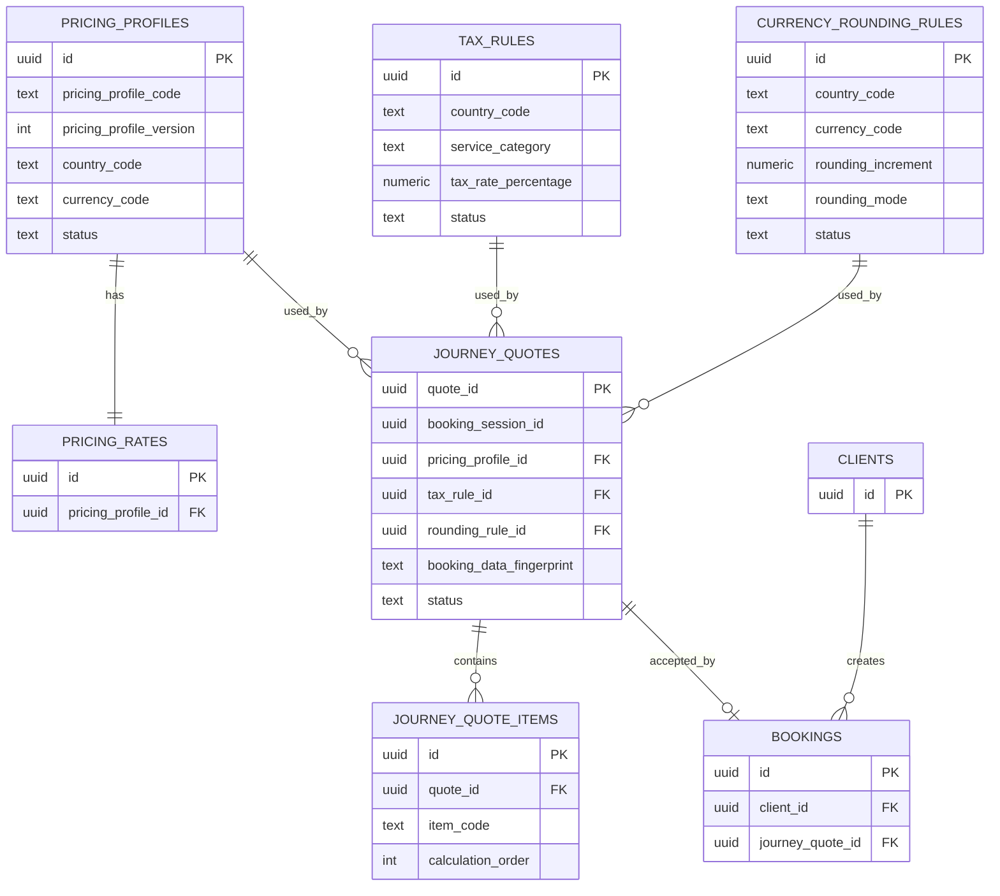

# Voya Taxi — Pricing Architecture & Process

> **Purpose:** A learning and project-reference document explaining how Voya Taxi calculates, stores, protects, and accepts journey prices.
>
> **Source:** Based on the current `database/schema.sql` supplied for the project and the implemented pricing workflow.
>
> **Status:** Living document. Update it as the Pricing Version develops.

---

## 1. Big Picture

The Voya Taxi pricing system answers one main question:

> **How much should this journey cost, and which exact rules produced that price?**

The pricing workflow is separated from invoicing.

```text
PRICING VERSION
Journey
   ↓
Determine pricing market
   ↓
Load pricing configuration
   ↓
Calculate journey price
   ↓
Create temporary quote
   ↓
Customer reviews quote
   ↓
Accept / replace / cancel quote
   ↓
Booking receives accepted quote
   ↓
--------------------------------
INVOICING VERSION
Invoice
   ↓
Payment
   ↓
Refund / correction
   ↓
Settlement / accounting records
```

---

# 2. Pricing Version — Processes

We use four numbered processes for the Pricing Version.

## Process 1 — Atomic Quote Creation

Goal:

```text
journey_quotes
+
journey_quote_items
+
replacement-quote voiding
=
one PostgreSQL transaction
```

If anything fails, everything rolls back.

**Current status:** In progress.

---

## Process 2 — Cross-Border Pricing Rules

Cross-border journeys are supported when the pickup country belongs to a supported Voya Taxi pricing market.

The pickup country determines the pricing market and pricing profile for the complete journey.

Example:

```text
Amsterdam, NL → Brussels, BE

Pickup country:       NL
Destination country:  BE
Pricing profile:      NL_DAYTIME_STANDARD
Currency:             EUR
Result:                Allowed
```
---

## Process 3 — Pricing Schedules / Time Rules

Process 3 selects the correct pricing-profile family from the planned journey date and time.
Pricing selection is based on the customer's planned pickup moment, not on the moment when the quote is created.
The pricing market is resolved first from the pickup country.

Example:

```text
Pickup country
    ↓
NL pricing market
    ↓
Journey date + time
    ↓
Pricing schedule
    ↓
Pricing-profile family
    ↓
Current active version
    ↓
Journey fare calculation
```
---

## Process 4 — Tax and Rounding Lifecycle

Complete administration/versioning for:

```text
tax_rules
currency_rounding_rules
```

These already have lifecycle structures in the database.

---

# 3. Important Architecture Rule

The selected website language must **never** determine:

- pricing country;
- currency;
- VAT/tax;
- pricing profile.

The server determines the pricing market from the journey.

Current high-level flow:

```text
Pickup coordinate
        ↓
Server reverse-geocodes pickup
        ↓
Verified pickup country
        ↓
Pricing market resolver
        ↓
Pricing profile
Tax rule
Rounding rule
```

The browser does not choose the financial market.

---

# 4. Tables Involved in Pricing

The main pricing-related tables are:

| Table | Purpose |
|---|---|
| `pricing_profiles` | Identifies a versioned pricing configuration |
| `pricing_rates` | Stores the monetary rates for one pricing profile |
| `tax_rules` | Stores VAT/tax rules |
| `currency_rounding_rules` | Stores final currency-rounding rules |
| `journey_quotes` | Stores the summary/snapshot of one temporary price quote |
| `journey_quote_items` | Stores the detailed calculation lines belonging to a quote |
| `bookings` | Links an accepted quote to the confirmed booking |
| `clients` | Stores the client linked to the booking |

---

# 5. Table Relationship Overview



---

# 6. `pricing_profiles`

## Simple meaning

> **Which pricing configuration/version are we using?**

Example:

```text
Pricing profile code: NL_DAYTIME_STANDARD
Version: 2
Country: NL
Currency: EUR
Status: active
Quote validity: 20 minutes
```

## Important columns

| Column | Meaning |
|---|---|
| `id` | Unique database identity of this pricing-profile version |
| `pricing_profile_code` | Business code, e.g. `NL_DAYTIME_STANDARD` |
| `pricing_profile_name` | Human-readable name |
| `pricing_profile_version` | Version number |
| `country_code` | Country, e.g. `NL` |
| `currency_code` | Currency, e.g. `EUR` |
| `quote_validity_minutes` | How long a temporary quote remains valid |
| `status` | `draft`, `active`, or `archived` |
| `effective_from` | When this configuration becomes applicable |
| `effective_until` | Optional end time |
| `created_by_user_id` | Admin/user who created it |
| `activated_by_user_id` | Admin/user who activated it |
| `archived_by_user_id` | Admin/user who archived it |
| `created_at` / `updated_at` | Audit timestamps |
| `activated_at` / `archived_at` | Lifecycle timestamps |

## Version rules

The database enforces a unique combination of:

```text
pricing_profile_code
+
pricing_profile_version
```

Example:

```text
NL_DAYTIME_STANDARD V1
NL_DAYTIME_STANDARD V2
NL_DAYTIME_STANDARD V3
```

A partial unique index ensures only **one active version** of a pricing-profile family.

Our agreed business rule is:

```text
V1 → archived
V2 → active
V3 → draft
V4 → draft
V5 → draft
```

Activating V4:

```text
V1 → archived
V2 → archived
V3 → draft
V4 → active
V5 → draft
```

Multiple drafts are allowed.

---

# 7. `pricing_rates`

## Simple meaning

> **What monetary rates belong to the selected pricing profile?**

Each pricing profile currently has one pricing-rate row.

## Important columns

| Column | Meaning |
|---|---|
| `id` | Unique pricing-rate row |
| `pricing_profile_id` | Links the rates to `pricing_profiles.id` |
| `base_fare_excluding_vat` | Starting fare |
| `distance_rate_per_km_excluding_vat` | Charge per kilometre |
| `duration_rate_per_minute_excluding_vat` | Charge per minute |
| `minimum_fare_excluding_vat` | Minimum allowed fare |
| `created_at` / `updated_at` | Audit timestamps |

The database has:

```text
UNIQUE (pricing_profile_id)
```

so one pricing profile has one current rates row.

## Example

```text
Pricing profile: NL_DAYTIME_STANDARD

Base fare:             €4.50
Distance rate:         €2.50/km
Duration rate:         €0.40/minute
Minimum fare:          €15.00 excluding VAT
```

---

# 8. `tax_rules`

## Simple meaning

> **Which tax/VAT rule applies?**

## Important columns

| Column | Meaning |
|---|---|
| `id` | Unique tax-rule row |
| `country_code` | Country |
| `tax_name` | Tax name, e.g. VAT |
| `service_category` | Business category, e.g. `passenger_transport` |
| `tax_rate_percentage` | Tax percentage |
| `status` | `draft`, `active`, `archived` |
| `effective_from` / `effective_until` | Validity period |
| lifecycle user/timestamp fields | Audit and version lifecycle |

The database permits only one active tax rule for the same:

```text
country_code
+
service_category
```

Example:

```text
Country: NL
Service: passenger_transport
Tax: VAT
Rate: 9%
```

---

# 9. `currency_rounding_rules`

## Simple meaning

> **How should the final customer-facing amount be rounded?**

## Important columns

| Column | Meaning |
|---|---|
| `id` | Unique rounding-rule row |
| `country_code` | Country |
| `currency_code` | Currency |
| `rounding_increment` | Smallest rounding increment |
| `rounding_mode` | `nearest`, `up`, or `down` |
| `status` | `draft`, `active`, `archived` |
| `effective_from` / `effective_until` | Validity period |
| lifecycle user/timestamp fields | Audit and version lifecycle |

The database permits only one active rounding rule for the same:

```text
country_code
+
currency_code
```

Example:

```text
Country: NL
Currency: EUR
Increment: 0.01
Mode: nearest
```

---

# 10. `journey_quotes`

## Simple meaning

> **What is the complete temporary quote?**

One journey quote creates one row in `journey_quotes`.

Example:

```text
Quote Q1
Country: NL
Currency: EUR
Distance: 10 km
Duration: 20 minutes
VAT: 9%
Final total: €40.49
Status: active
```

## Important identity/reference columns

| Column | Meaning |
|---|---|
| `quote_id` | Unique identity of this exact quote |
| `booking_session_id` | Which unfinished booking attempt created it |
| `pricing_profile_id` | Exact pricing profile used |
| `tax_rule_id` | Exact tax rule used |
| `rounding_rule_id` | Exact rounding rule used |
| `booking_data_fingerprint` | Hash used to verify the quote still belongs to the same journey |

## Pricing snapshot columns

| Column | Meaning |
|---|---|
| `pricing_profile_code` | Business code used when quote was calculated |
| `pricing_profile_version` | Pricing version used |
| `pricing_calculation_version` | Version of calculation logic |
| `country_code` | Pricing country |
| `currency_code` | Quote currency |
| `distance_km` | Calculated route distance |
| `estimated_duration_minutes` | Calculated route duration |
| `tax_rate_percentage` | Tax percentage used |
| `basic_fare_excluding_vat` | Current subtotal-style field before VAT |
| `vat_amount` | Calculated VAT |
| `total_including_vat_before_rounding` | Total before final currency rounding |
| `final_total_including_vat` | Final customer price |

> Note: `basic_fare_excluding_vat` currently acts as the stored subtotal field. The schema notes that it may later be renamed to `subtotal_excluding_vat` together with application code.

## Lifecycle columns

```text
status
created_at
expires_at
used_at
accepted_at
voided_at
```

The quote statuses are:

```text
active
accepted
voided
```

---

# 11. `journey_quote_items`

## Simple meaning

> **How was the quote calculated?**

This is the main distinction:

> `journey_quotes` = **WHAT the final quote is**  
> `journey_quote_items` = **HOW the final quote was calculated**

Example:

```text
journey_quotes

Q1 → Final total €40.49
│
└── journey_quote_items
    ├── Base fare
    ├── Distance fare
    └── Duration fare
```

Later more lines can be added without changing the quote table:

```text
Night surcharge
Airport surcharge
Waiting time
Pet surcharge
Holiday surcharge
Discount
Promotion
```

## Columns

| Column | Meaning |
|---|---|
| `id` | Unique identity of this calculation line |
| `quote_id` | Parent quote |
| `item_code` | Machine-readable item code |
| `description` | Human-readable description |
| `quantity` | Quantity used in calculation |
| `unit` | Unit such as `km`, `minute`, etc. |
| `unit_amount_excluding_vat` | Price per unit before VAT |
| `amount_excluding_vat` | Line amount before VAT |
| `vat_rate_percentage` | VAT rate applied to the line |
| `vat_amount` | VAT amount for the line |
| `amount_including_vat` | Line amount after VAT |
| `calculation_order` | Display/calculation order |
| `created_at` | Creation timestamp |

The database requires:

```text
UNIQUE (quote_id, calculation_order)
```

so the same quote cannot have two calculation rows in the same order position.

---

# 12. Why `journey_quotes` and `journey_quote_items` Are Separate

Imagine an invoice.

```text
Invoice 1001
Customer: John
Total: €120
```

That is like `journey_quotes`.

Then:

```text
Taxi ride       €90
Waiting time    €20
Other charge    €10
```

Those are like `journey_quote_items`.

Separating summary and details means we can add future pricing components without continuously adding new columns to `journey_quotes`.

---

# 13. Understanding All the IDs

The word `id` appears often, but each ID has a different responsibility.

| Field | Easy question it answers |
|---|---|
| `quote_id` | **Which exact quote is this?** |
| `journey_quote_items.id` | **Which exact calculation line is this?** |
| `journey_quote_items.quote_id` | **Which quote does this line belong to?** |
| `booking_session_id` | **Which unfinished booking attempt are these quotes part of?** |
| `pricing_profile_id` | **Which pricing configuration did we use?** |
| `tax_rule_id` | **Which tax rule did we use?** |
| `rounding_rule_id` | **Which rounding rule did we use?** |
| `bookings.journey_quote_id` | **Which accepted quote created this booking?** |
| `booking_data_fingerprint` | **Does this quote still match this journey?** |

---

# 14. ID Example

One unfinished booking:

```text
booking_session_id = SESSION-AAA
```

First quote:

```text
quote_id = Q1
booking_session_id = SESSION-AAA
```

Calculation lines:

```text
id = I1, quote_id = Q1 → Base fare
id = I2, quote_id = Q1 → Distance fare
id = I3, quote_id = Q1 → Duration fare
```

Customer changes destination:

```text
SESSION-AAA
│
├── Q1 → voided
│   ├── I1
│   ├── I2
│   └── I3
│
└── Q2 → active
    ├── I4
    ├── I5
    └── I6
```

The booking session stays the same because it is still the same unfinished booking attempt.

The quote ID changes because Q2 is a different financial quote.

---

# 15. `booking_session_id`

## Simple meaning

> **Which unfinished booking attempt does this quote belong to?**

It is not a customer ID.

It is also not the quote ID.

Example:

```text
Customer begins booking
→ Session AAA

Review
→ Q1 belongs to AAA

Change route
→ Q1 voided
→ Q2 belongs to AAA

Cancel/reset
→ Session AAA ends

New booking attempt
→ Session BBB
```

Multiple quotes may share one `booking_session_id`.

---

# 16. `booking_data_fingerprint`

The fingerprint is **not really an identity field**.

It is a SHA-256 hash representing normalized pricing-relevant journey information.

Currently it represents:

```text
pickup coordinates
+
destination coordinates
```

Concept:

```text
Quote created from Journey A
        ↓
fingerprint stored
        ↓
Customer confirms booking
        ↓
Server rebuilds fingerprint
        ↓
same fingerprint?
YES → continue
NO  → reject quote
```

Two separately created quotes for exactly the same coordinates may have the same fingerprint.

That is normal.

`quote_id` remains the unique identity of the quote.

---

# 17. `bookings`

The `bookings` table contains:

```text
journey_quote_id
```

which references:

```text
journey_quotes.quote_id
```

Its purpose is:

> **Remember exactly which accepted quote was used when this booking was created.**

Important database rule:

```text
UNIQUE (journey_quote_id)
```

Therefore one journey quote can create at most one booking.

`ON DELETE RESTRICT` prevents deleting an accepted quote while a booking still points to it.

Historical/admin-created bookings may have `journey_quote_id = NULL`.

---

# 18. `clients`

`clients` is not a pricing-calculation table, but it participates in the confirmed booking relationship.

Important columns:

```text
id
name
email
phone
created_at
updated_at
```

Relationship:

```text
clients.id
   ↓
bookings.client_id
```

---

# 19. Quote Lifecycle

## Active quote

```text
status = active
used_at = NULL
accepted_at = NULL
voided_at = NULL
```

An active quote is only usable if it is also not expired.

---

## Accepted quote

```text
status = accepted
used_at = timestamp
accepted_at = timestamp
voided_at = NULL
```

An accepted quote cannot be voided by the unfinished-booking cancellation process.

---

## Voided quote

```text
status = voided
used_at = NULL
accepted_at = NULL
voided_at = timestamp
```

A voided quote cannot later be accepted.

The database has lifecycle constraints that enforce these combinations.

---

# 20. Replacement Quote Lifecycle

Example:

```text
Session AAA

Q1 → active
```

Customer changes journey:

```text
Q1 → voided
```

New Review:

```text
Session AAA

Q1 → voided
Q2 → active
```

The server also has replacement-quote protection so older active quotes in the same booking session can be voided safely.

---

# 21. Cancel / Abandon Lifecycle

When the customer clicks **Cancel booking**:

```text
Browser
   ↓
POST /api/journey-quotes/void
   ↓
Next.js server
   ↓
supabaseAdmin / service_role
   ↓
void_abandoned_journey_quote(...)
   ↓
active quote → voided
```

The function requires both:

```text
quote_id
+
booking_session_id
```

This proves the request is targeting the exact quote belonging to the expected unfinished booking session.

A repeated Cancel is safe:

```text
First request  → true
Second request → false
```

---

# 22. Booking Confirmation Lifecycle

The booking confirmation contains the selected:

```text
journeyQuoteId
```

The server then verifies:

```text
quote exists
+
fingerprint matches
+
status = active
+
quote is not expired
+
used_at = NULL
+
accepted_at = NULL
```

Then booking creation and quote acceptance happen atomically.

```text
Create booking
+
active quote → accepted
=
one PostgreSQL transaction
```

---

# 23. Important PostgreSQL Functions

## `create_booking_with_accepted_journey_quote(...)`

Purpose:

> Create a booking and accept its journey quote inside one PostgreSQL transaction.

If one step fails, PostgreSQL rolls back the complete operation.

---

## `void_replaced_journey_quotes_for_session(...)`

Purpose:

> Keep the newest quote and void older active quotes belonging to the same unfinished booking session.

It uses a booking-session advisory transaction lock.

Only `service_role` may execute it.

---

## `void_abandoned_journey_quote(...)`

Purpose:

> Void one exact active quote when the unfinished booking is abandoned.

It verifies:

```text
quote exists
booking_session_id matches
quote is not accepted
quote is not already used
```

Only `service_role` may execute it.

---

## `create_pricing_profile_draft(...)`

Purpose:

> Create a new draft version based on an existing pricing configuration.

---

## `update_pricing_profile_draft(...)`

Purpose:

> Update editable pricing-profile and rate values while the profile is still draft.

---

## `activate_pricing_profile_draft(...)`

Purpose:

> Activate one draft pricing version and archive the previously active version of the same pricing-profile family.

---

# 24. Financial Configuration Status

The database enum:

```text
financial_configuration_status
```

contains:

```text
draft
active
archived
```

This status is used for financial configuration such as:

```text
pricing_profiles
tax_rules
currency_rounding_rules
```

Do not confuse this with journey quote status.

---

# 25. Journey Quote Status

The database enum:

```text
journey_quote_status
```

contains:

```text
active
accepted
voided
```

This describes the lifecycle of a calculated customer quote.

---

# 26. Database Security

Sensitive financial functions use:

```sql
SECURITY DEFINER
SET search_path = public, pg_temp
```

Execution permission is removed from:

```text
PUBLIC
anon
authenticated
```

and granted only to:

```text
service_role
```

Application flow:

```text
Browser
   ↓
Next.js API route
   ↓
supabaseAdmin
   ↓
service_role
   ↓
protected PostgreSQL RPC/function
```

The browser never receives the service-role secret.

---

# 27. Current Quote Creation Weak Point

Before Process 1 is complete, quote creation currently works as separate operations:

```text
Insert journey_quotes
        ↓
Insert journey_quote_items
        ↓
Void older replacement quote
```

If item insertion fails, the API currently performs compensating cleanup by deleting the quote header.

Conceptually:

```text
Insert quote header ✅
Insert quote items ❌
        ↓
DELETE quote header
```

This works, but it is not a true atomic transaction.

The cleanup itself could theoretically fail.

---

# 28. Process 1 Target — Atomic Quote Creation

We want one protected PostgreSQL operation:

```text
BEGIN TRANSACTION
        ↓
Lock booking session
        ↓
Insert journey_quotes
        ↓
Insert all journey_quote_items
        ↓
Void older active quote(s) from same session
        ↓
Everything successful?
   YES → COMMIT
   NO  → ROLLBACK
```

Failure example:

```text
Q1 = active

Try to create Q2
        ↓
one Q2 item violates a database constraint
        ↓
ROLLBACK
        ↓
Q1 remains active
Q2 does not exist
Q2 items do not exist
```

This removes manual cleanup from the API.

---

# 29. Why Process 1 Matters

A financial quote is not only the final number.

It includes:

```text
summary
+
calculation details
+
pricing configuration identity
+
tax rule identity
+
rounding rule identity
+
journey identity
+
lifecycle state
```

Therefore:

> **The quote header and calculation items should never be partially stored.**

Atomic quote creation guarantees:

> **Everything is saved, or nothing is saved.**

---

# 30. Pricing Calculation Mental Model

```text
pricing_profiles
= Which pricing version?

pricing_rates
= Which rates?

tax_rules
= Which VAT/tax?

currency_rounding_rules
= How do we round?

journey_quotes
= What is the final quote?

journey_quote_items
= How was the quote calculated?

booking_session_id
= Which unfinished booking attempt?

booking_data_fingerprint
= Does the quote still match the journey?

bookings.journey_quote_id
= Which accepted quote belongs to the booking?
```

---

# 31. Current Example Configuration

The canonical schema includes an initial Netherlands pricing configuration for passenger transport.

The fresh-database foundation contains three active Version 1 pricing-profile families:

```text
NL_DAYTIME_STANDARD
NL_NIGHT_STANDARD
NL_WEEKEND_STANDARD
```

All three initially use:

```text
Country: NL
Currency: EUR
Service category: passenger_transport

Base fare: €4.50
Distance: €2.50/km
Duration: €0.40/minute
Minimum fare: €15.00 excluding VAT
Quote validity: 20 minutes
```

The Netherlands financial rules currently include:

```text
VAT: 9%
Rounding: nearest €0.01
```

The recurring pricing schedule selects the appropriate family:

```text
Monday-Friday

00:00-06:00 → NL_NIGHT_STANDARD
06:00-22:00 → NL_DAYTIME_STANDARD
22:00-24:00 → NL_NIGHT_STANDARD

Saturday-Sunday

00:00-24:00 → NL_WEEKEND_STANDARD
```

Holiday and Event pricing families are not seeded automatically.

They can be created through the admin pricing workflow when required and connected to specific date/time periods through `pricing_schedule_overrides`.

Important:

> The canonical seed provides the starting configuration for a fresh database. The live database can contain later profile versions, archived versions, drafts, and administrator-created Holiday or Event pricing families.

---

# 32. Current Pricing Architecture Progress

Already implemented:

- versioned pricing profiles;
- draft / active / archived lifecycle;
- one-active-profile rule;
- pricing rates;
- tax rules;
- currency rounding rules;
- quote expiration;
- server-side pricing-market resolution;
- temporary quote creation;
- detailed quote calculation items;
- booking-session IDs;
- journey fingerprints;
- replacement quote voiding;
- abandoned quote voiding;
- accepted-quote protection;
- atomic booking + quote acceptance;
- service-role protected financial functions;
- cross-border destination-country support;
- pickup-country commercial pricing rules;
- recurring Daytime / Night / Weekend pricing schedules;
- Holiday / Event pricing overrides;
- override priority handling;
- duplicate override protection;
- journey date/time included in pricing selection;
- date/time included in pricing fingerprint;
- admin creation of new pricing-profile families;
- first-version activation for new pricing families;
- automated pricing tests.

Completed pricing processes:

```text
Process 1 → Atomic Quote Creation          ✅
Process 2 → Cross-Border Pricing Rules    ✅
Process 3 → Pricing Schedules / Time Rules ✅
```

Current status:

> **Pricing Version — Process 3 is complete.**

Next:

```text
Process 4 → Tax and Rounding Lifecycle
Process 5 → Invoicing Version
```

---

Already implemented:

- versioned pricing profiles;
- draft / active / archived lifecycle;
- one-active-profile rule;
- pricing rates;
- tax rules;
- currency rounding rules;
- quote expiration;
- server-side pricing-market resolution;
- temporary quote creation;
- detailed quote calculation items;
- booking-session IDs;
- journey fingerprints;
- replacement quote voiding;
- abandoned quote voiding;
- accepted-quote protection;
- atomic booking + quote acceptance;
- service-role protected financial functions;
- automated pricing tests.

Current focus:

> **Pricing Version — Process 1: Atomic Quote Creation**

Next:

```text
Process 2 → Cross-Border Pricing Rules
Process 3 → Pricing Schedules / Time Rules
Process 4 → Tax and Rounding Lifecycle
Process 5 → Invoicing Version
```

---

# 33. Key Learning Summary

Remember these sentences:

> **`pricing_profiles` tells us which pricing version applies.**

> **`pricing_rates` tells us the actual monetary rates.**

> **`tax_rules` tells us which VAT/tax applies.**

> **`currency_rounding_rules` tells us how the final currency amount is rounded.**

> **`journey_quotes` tells us WHAT the final quote is.**

> **`journey_quote_items` tells us HOW the quote was calculated.**

> **`booking_session_id` groups quotes belonging to one unfinished booking attempt.**

> **`quote_id` uniquely identifies one financial quote.**

> **`booking_data_fingerprint` verifies that the quote still belongs to the same pricing-relevant journey.**

> **`bookings.journey_quote_id` permanently links the booking to the exact accepted quote.**

---

# 34. Maintenance Rule for This Document

Update this Markdown file whenever one of these changes:

- pricing table structure;
- quote lifecycle;
- pricing profile lifecycle;
- tax or rounding lifecycle;
- quote calculation items;
- financial RPCs/functions;
- pricing-market selection rules;
- Process 1–4 implementation;
- boundary between Pricing Version and Invoicing Version.

Suggested project location:

```text
docs/PRICING_ARCHITECTURE.md
```
