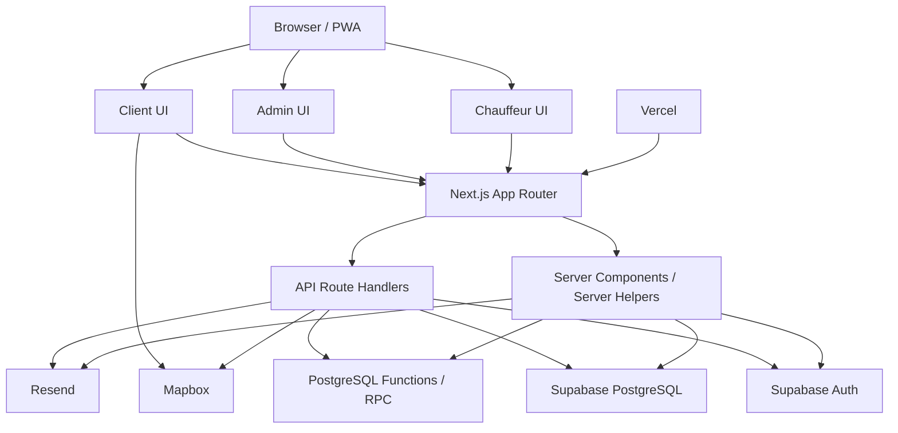

# Voya Taxi — System Architecture

> **Purpose:** High-level reference for how the complete Voya Taxi application is organized and how its main layers communicate.
>
> **Status:** Living document. Update this file whenever a major application layer, external service, route family, or data flow changes.

---

# 1. What This Document Explains

This document answers:

> **How does the complete Voya Taxi application fit together?**

It focuses on the application as a whole rather than one business process.

Related documents:

```text
docs/
├── SYSTEM_ARCHITECTURE.md
├── AUTH_SECURITY_ARCHITECTURE.md
├── BOOKING_ARCHITECTURE.md
├── PRICING_ARCHITECTURE.md
└── CHAUFFEUR_OPERATIONS_ARCHITECTURE.md
```

Later:

```text
docs/INVOICING_ARCHITECTURE.md
```

---

# 2. Main Technology Stack

| Layer | Technology |
|---|---|
| Web framework | Next.js App Router |
| UI | React |
| Language | TypeScript |
| Styling | Tailwind CSS |
| Database | PostgreSQL through Supabase |
| Authentication | Supabase Auth |
| Server/database integration | Supabase JS clients + PostgreSQL RPC/functions |
| Maps/search/routes | Mapbox |
| Email | Resend |
| Deployment | Vercel |
| Version control | Git + GitHub |
| Application mode | Responsive web app + PWA |
| Automated unit tests | Vitest |

---

# 3. Three Main Application Areas

Voya Taxi has three connected user-facing areas.

## 3.1 Client Application

Main responsibilities:

```text
Search pickup/destination
Enter passenger requirements
Calculate route
Request price quote
Review booking
Confirm booking
Receive booking reference
Check booking status
Register as chauffeur
Check chauffeur-registration status
```

Main access model:

```text
mostly public
```

Sensitive server/database work still happens through trusted server code.

---

## 3.2 Admin Application

Main responsibilities:

```text
Bookings
Clients
Chauffeurs
Vehicles
Availability
Assignment
Assignment alerts
Pricing administration
Status management
Operational corrections
```

Access model:

```text
authenticated administrator
```

Admin routes must verify the logged-in Supabase user and application role before trusted operations.

---

## 3.3 Chauffeur Application

Main responsibilities:

```text
Own chauffeur dashboard
Own availability
Vehicle overview
Open-booking feed
Secure booking claim
Profile/change requests
Assigned work
```

Access model:

```text
authenticated chauffeur
```

The chauffeur identity is derived from:

```text
Supabase Auth user
        ↓
user_profiles
        ↓
chauffeur_id
        ↓
chauffeurs
```

---

# 4. High-Level System Diagram



---

# 5. Project Organization Rule

A useful project rule is:

> **`page.tsx` keeps the route active; substantial page logic should live in a clearly named page component when that improves readability.**

Examples:

```text
src/app/admin/bookings/page.tsx
        ↓
AdminBookingsPage.tsx

src/app/status/page.tsx
        ↓
StatusPage

src/app/page.tsx
        ↓
HomePage.tsx
```

This avoids having many unrelated files all named only:

```text
page.tsx
```

---

# 6. Main Source-Code Layers

| Pattern | Responsibility |
|---|---|
| `src/app/**/page.tsx` | Next.js route entry |
| named `*Page.tsx` files | Main readable page implementation |
| `src/components/*.tsx` | Reusable UI and interactive components |
| `src/app/api/**/route.ts` | HTTP/server boundary |
| `src/types/*.ts` | Shared TypeScript contracts |
| `src/lib/**/*.ts` | Domain logic, integrations, auth helpers, formatting |
| `src/lib/pricing/*.ts` | Pricing calculation and quote logic |
| `src/lib/i18n/*.ts` | Language configuration and translations |
| `src/styles/classNames.ts` | Reusable Tailwind class groups |
| `database/YYYY-MM-DD-*.sql` | Dated database migrations |
| `database/schema.sql` | Complete current schema snapshot |
| `tests/unit/**` | Unit tests |

---

# 7. Frontend Architecture

The React frontend primarily performs:

```text
collect input
        ↓
manage local UI state
        ↓
show loading / errors / success
        ↓
call trusted server endpoints
        ↓
render returned data
```

Important frontend principle:

> **The browser may collect and display business information, but it must not be the final authority for sensitive financial, identity, or assignment decisions.**

Examples:

```text
Browser may display route distance
Server determines pricing configuration

Browser may send booking ID for a claim
Database derives chauffeur ID from authenticated user

Browser may display a quote
Database verifies quote before booking acceptance
```

---

# 8. BookingForm as a Main Client Workflow

The booking form connects several system layers:

```text
BookingForm
        ↓
Mapbox location search
        ↓
route estimate
        ↓
POST /api/journey-quotes
        ↓
server pricing
        ↓
temporary quote
        ↓
Review
        ↓
POST /api/bookings
        ↓
atomic booking + quote acceptance
```

The form stores temporary UI state such as:

```text
pickup location
destination location
route estimate
journey quote
booking draft
booking session ID
review state
submitted booking
passenger-support choices
```

---

# 9. Mapbox Integration

Mapbox supports:

```text
location search
structured selected locations
coordinates
city information
route distance
route duration
reverse geocoding
```

Important separation:

```text
Browser location selection
        ↓
coordinates
        ↓
server-side route/pricing verification
```

Pricing market selection must remain server-side.

The selected website language never determines:

```text
country
currency
VAT
pricing profile
```

---

# 10. Supabase Integration

Supabase is used for two distinct responsibilities:

```text
Supabase Auth
        +
PostgreSQL database
```

These should be mentally separated.

## Auth

Answers:

```text
Who is logged in?
```

## PostgreSQL

Answers:

```text
What data exists?
What business rules apply?
What relationships are valid?
```

---

# 11. Two Main Supabase Client Patterns

Voya Taxi uses different server-side clients for different trust levels.

## Normal authenticated server client

Conceptually:

```text
src/lib/supabase/server.ts
        ↓
Supabase Auth cookies/session
        ↓
authenticated user permissions
```

Used when the server needs to know the current logged-in user.

## Trusted admin/service client

Conceptually:

```text
src/lib/supabaseServer.ts
        ↓
supabaseAdmin
        ↓
server secret / service role
```

Used only in trusted server code for operations that browser roles must not perform directly.

Important:

> **Never expose the service-role secret to client-side code.**

---

# 12. Database Architecture

The PostgreSQL database contains more than storage.

It also enforces business rules through:

```text
primary keys
foreign keys
unique indexes
check constraints
enum types
RLS
triggers
PostgreSQL functions
row locks
transactions
advisory locks
```

This means:

> **Critical rules are protected by the database itself, not only by React or API code.**

---

# 13. Major Database Domains

```text
CLIENT / BOOKING
clients
bookings

CHAUFFEUR OPERATIONS
chauffeurs
vehicles
chauffeur_availability
chauffeur_change_requests
assignment_alerts
user_profiles

PRICING
pricing_profiles
pricing_rates
tax_rules
currency_rounding_rules
journey_quotes
journey_quote_items
```

Later the financial domain will expand with invoicing/payment tables.

---

# 14. API Route Architecture

API routes are trusted HTTP boundaries.

Typical responsibilities:

```text
receive request
        ↓
parse JSON / parameters
        ↓
validate types and values
        ↓
authenticate when required
        ↓
verify role/ownership when required
        ↓
call trusted domain/database logic
        ↓
shape response
        ↓
return meaningful HTTP status
```

Common status meanings used in the project:

```text
200 → successful request
201 → created
400 → invalid request
401 → not logged in
403 → logged in but not allowed
409 → business-state conflict
500 → unexpected server/database failure
```

---

# 15. PostgreSQL RPC Architecture

Complex and sensitive multi-step rules are increasingly moved into PostgreSQL functions.

Examples:

```text
create_booking_with_accepted_journey_quote(...)
update_booking_admin_assignment(...)
validate_booking_assignment(...)
sync_booking_assignment_alert(...)
claim_open_booking(...)
create_pricing_profile_draft(...)
update_pricing_profile_draft(...)
activate_pricing_profile_draft(...)
void_replaced_journey_quotes_for_session(...)
void_abandoned_journey_quote(...)
```

Why?

```text
one transaction
+
central business rules
+
database locks
+
rollback on failure
+
less partial state
```

---

# 16. Authentication and Role Flow

```text
Supabase Auth user UUID
        ↓
user_profiles.user_id
        ↓
role
        ↓
admin OR chauffeur
```

For a chauffeur:

```text
user_profiles.chauffeur_id
        ↓
chauffeurs.id
```

This is documented in detail in:

```text
docs/AUTH_SECURITY_ARCHITECTURE.md
```

---

# 17. Internationalization Architecture

The application uses one route structure with translated UI text rather than duplicating pages per language.

Main pattern:

```text
LanguageProvider
        ↓
current language
        ↓
translation helpers
        ↓
translated labels/messages
```

Main files include:

```text
src/lib/i18n/languages.ts
src/lib/i18n/translations.ts
src/components/LanguageProvider.tsx
src/components/LanguageSwitcher.tsx
```

Stable technical values should not be translated before database/API use.

Example:

```text
database value: pending_approval
visible Dutch label: translated
```

The database value remains stable.

---

# 18. Current Supported Interface Languages

Current language foundation supports:

```text
English
Dutch
Arabic
Turkish
Farsi
```

Arabic and Farsi require RTL layout support.

Language is a UI concern, not a pricing-market selector.

---

# 19. Styling Architecture

The visual system uses:

```text
Tailwind CSS
+
shared class groups
```

Important shared file:

```text
src/styles/classNames.ts
```

This reduces repeated long class strings and keeps the visual system more consistent.

The application uses a dark slate foundation with cyan structural accents and yellow primary actions.

---

# 20. PWA Architecture

The application has Progressive Web App support.

Concept:

```text
Next.js application
        ↓
manifest
        ↓
PWA icons
        ↓
standalone installation
```

Installation has been tested on desktop and phone.

PWA support changes how the app can be launched, but not the core booking/database architecture.

---

# 21. Email Architecture

Email is separated into responsibilities such as:

```text
email types
        ↓
templates
        ↓
notification coordinator
        ↓
email sender
        ↓
Resend
```

The sender can safely skip sending when required production environment variables are absent.

Email must remain a notification layer, not the source of truth for booking state.

---

# 22. Deployment Architecture

```text
Local development
        ↓
Git
        ↓
GitHub repository
        ↓
Vercel deployment
```

Database migrations are applied separately to Supabase.

Important:

```text
Git push
```

deploys application code through Vercel integration, but does not automatically mean every SQL migration has been applied to Supabase.

---

# 23. Migration vs Schema Snapshot

## Dated migration

Example:

```text
database/2026-08-09-void-abandoned-journey-quote.sql
```

Purpose:

> Upgrade an existing database safely.

## Canonical schema

```text
database/schema.sql
```

Purpose:

> Describe the complete current database for a clean installation/reference.

Rule:

> After a migration is accepted, synchronize the final structure into `schema.sql`.

Do not blindly rerun the entire canonical schema against production.

---

# 24. Main Business Data Flows

## Booking

```text
Client UI
→ booking form
→ route
→ quote
→ review
→ confirmation
→ booking
```

See:

```text
BOOKING_ARCHITECTURE.md
```

## Pricing

```text
route
→ market
→ pricing configuration
→ fare calculation
→ quote
→ accepted / voided
```

See:

```text
PRICING_ARCHITECTURE.md
```

## Chauffeur Operations

```text
registration
→ approval
→ authenticated chauffeur
→ vehicles
→ availability
→ open booking
→ claim
→ assignment
```

See:

```text
CHAUFFEUR_OPERATIONS_ARCHITECTURE.md
```

---

# 25. Testing Architecture

Current automated tests focus strongly on pricing/domain functions.

Common workflow:

```text
npm.cmd run test
npm.cmd run lint
npm.cmd run build
git diff --check
```

Testing layers can later expand to:

```text
unit tests
API tests
database/RPC tests
end-to-end tests
```

---

# 26. Current Trust Model

The application is designed around this rule:

> **Trust decreases as data moves toward the browser. Critical decisions move toward the server/database.**

```text
Browser
lowest trust
        ↓
Next.js server
trusted application boundary
        ↓
PostgreSQL
authoritative data/business-rule boundary
```

Examples:

```text
Browser does not choose chauffeur identity for claim
Browser does not choose service-role permissions
Browser does not decide VAT
Browser does not directly accept a quote in the database
```

---

# 27. What Belongs in Other Architecture Documents

This file should remain high-level.

Detailed rules belong in:

```text
PRICING_ARCHITECTURE.md
→ pricing configuration, quotes, quote items, pricing lifecycle

BOOKING_ARCHITECTURE.md
→ booking creation, statuses, assignment, alerts

AUTH_SECURITY_ARCHITECTURE.md
→ auth, roles, RLS, service role, trust boundaries

CHAUFFEUR_OPERATIONS_ARCHITECTURE.md
→ chauffeur lifecycle, vehicles, availability, claims
```

---

# 28. Future System Areas

The largest planned system addition is:

```text
INVOICING VERSION
```

Expected future areas include:

```text
invoices
payments
refunds/corrections
chauffeur settlements
accounting/financial records
```

These should get their own architecture document when implemented.

---

# 29. Production Hardening — Separate from Feature Architecture

Feature completeness is not the same as production hardening.

Future production-readiness work can include:

```text
formal RLS review
rate limiting
abuse protection
password recovery review
email monitoring
error monitoring
backups
performance testing
accessibility testing
mobile-browser testing
timezone testing
privacy/GDPR documentation
operational support procedures
```

---

# 30. Key Learning Summary

Remember:

> **React displays and collects state.**

> **Next.js routes/server code are the trusted application boundary.**

> **Supabase Auth identifies the user.**

> **`user_profiles` gives the user an application role.**

> **PostgreSQL stores data and enforces critical business rules.**

> **Mapbox provides location/route information, but does not decide Voya Taxi pricing rules.**

> **Resend sends notifications, but email is not the source of truth.**

> **Git/GitHub/Vercel deploy application code; Supabase migrations manage database structure.**

> **The architecture is deliberately layered so one part can change without rewriting the entire system.**

---

# 31. Maintenance Rule

Update this document whenever one of these changes:

```text
major technology
main application area
route organization
API architecture
database domain
external service
deployment flow
auth model
major data flow
PWA/i18n foundation
testing strategy
```
